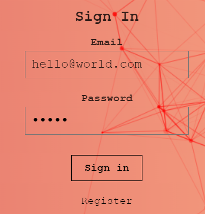

# Smart Brain Client

A React App that detects, then highlights faces in web images. Including a user profile with image upload count and a Ranking Badge served from AWS Lambda as a serverless function.

Built with React.js, Node.js, Express, Bcrypt, PostgreSQL, Redis, Tachyon CSS, Clarifai Face Detection API, and all running on Heroku Servers 'synched' with GitHub.

Back-end Server Repo Link: https://github.com/Sonnyburni/smart-brain-api

<i>Thanks to Andrei Neagoie for creating the [ZTM Web Developer Zero to Mastery](https://www.udemy.com/the-complete-web-developer-zero-to-mastery) and [ZTM Junior to Senior Web Developer](https://www.udemy.com/course/the-complete-junior-to-senior-web-developer-roadmap/) courses which SmartBrain is based on.
  
Since completing both courses and further personal development I have also updated the SmartBrain app further extensively, adding numerous updates, bug fixes etc. With the fundamental update being to adapt it to run 100% remotely with Heroku hosting the site in tandem with PostgreSQL DB, Redis DB and AWS Lambda servers too.
I have also implemented validation for both email and password fields on sign up.
</i>

 

## Demo

  
:rocket: **[View Live Demo](https://sonny-smart-brain.herokuapp.com/)** :rocket: 
  

## How to use

You can use the following test login details <i>(ensure lowercase as case sensitive)</i>

 
<b>Email:</b> hello@world.com
 
<b>Password:</b> world
 

  
 
 
_**Please note: Site may take a few seconds to initially load due to using Heroku .**_

Or you can click on the 'Register' tab and create your own new login details to use instead.

Once logged in simply copy, then paste an image url from the web (example: https://i.natgeofe.com/n/a66a4e3e-ba36-4ca1-bfb3-a3751bfaf110/83704.jpg) into the search input field, then click the 'DETECT' button to run the Face Detection API.

Each time you upload an image the 'Total Images Submitted' value is incremented by +1.
You can view the current total in the 'View Profile' tab, along with the 'Current Rank 'Badge', which is fed from AWS Lambda as a serverless function.

The Rank Badge updates based on the current image upload count.
 
Total Images Submitted | Current Rank 'Badge'
------------ | -------------
0 | 😐
1 | 😃
2 | 😀
3 | 😊
4 | 😉
5 | 😍
6 | 🔶
7 | 🔷
8 or over | 🚀
 

## Features
<ul>
<li>Multi-Face Detection using Clarifai Face Detection API</li>
 
<li>Ranking badge element served from external AWS Lambda as a serverless function</li>
 
<li>User authentication using JSON Web Tokens (JWT)</li>
 
<li>With a Redis Database for Token Management</li>
 
<li>User profile with capture of image uploads, stored via a PostgreSQL Database</li>
 
<li>TS Particles for background animation</li>
 
<li>Parallax tilt for interactive site logo</li>
 
<li>Form validation</li>
 
<li>Bcrypt user password encryption/decryption to/from PostgreSQL Database</li>
 
<li>Editable user profile</li>
 

